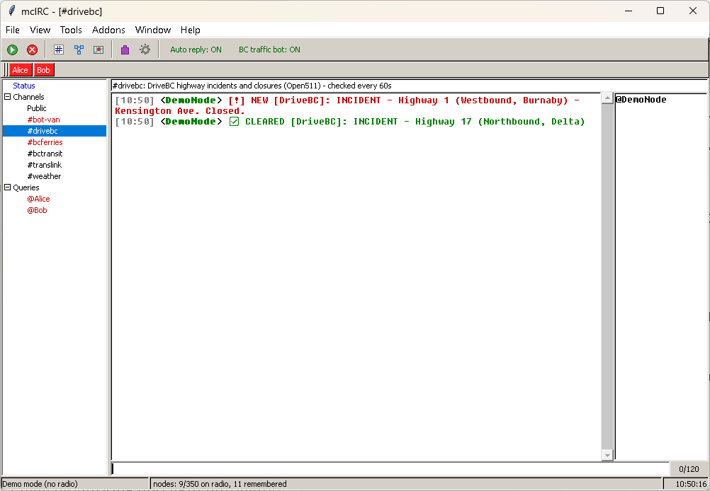
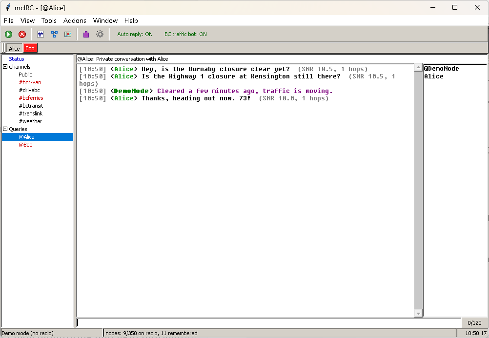
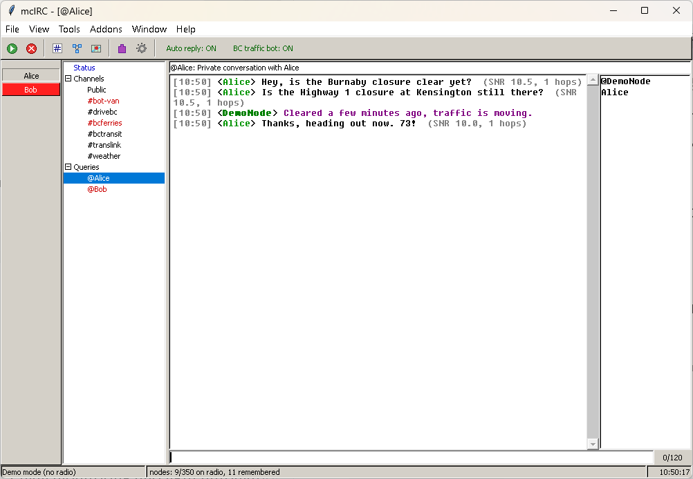
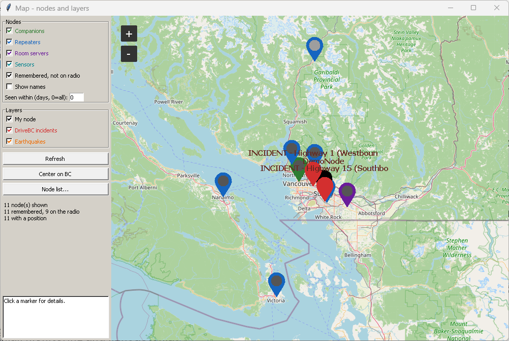
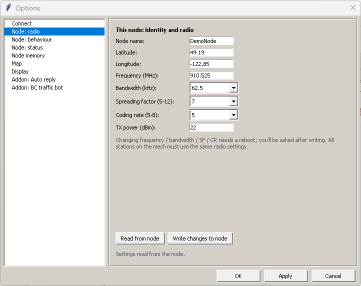
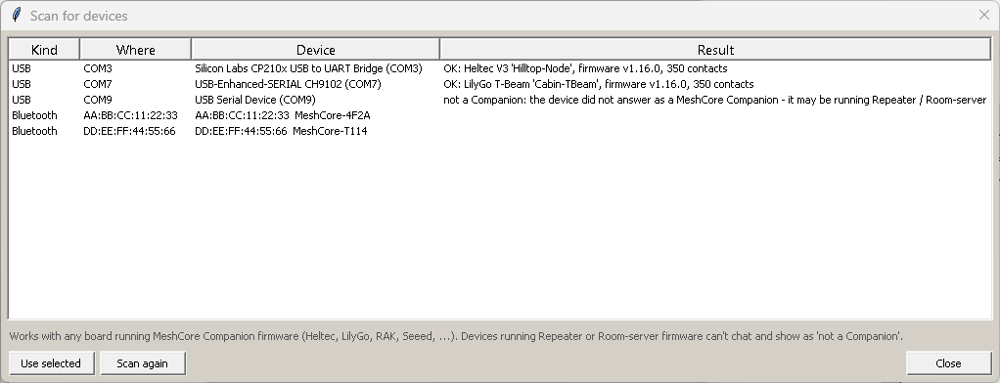
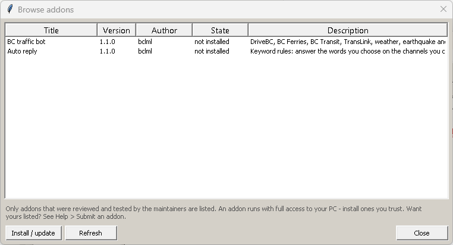
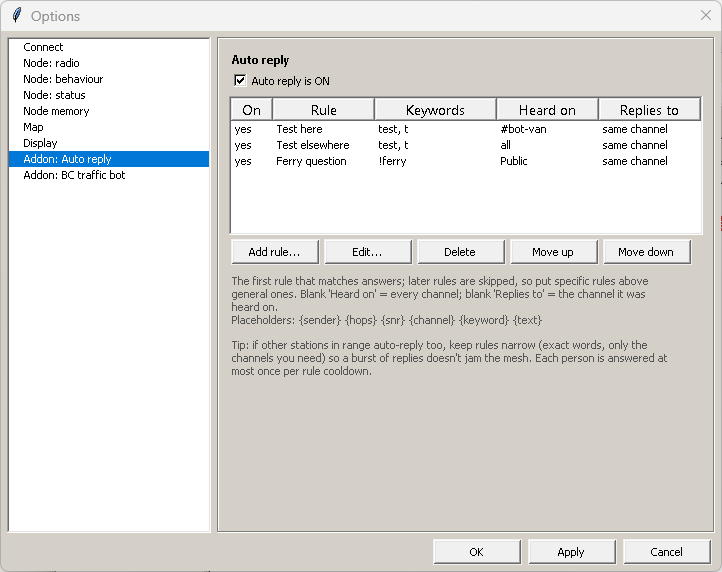

# mcIRC

An **mIRC-style chat client for [MeshCore](https://meshcore.co.uk/) LoRa mesh nodes** on Windows: channels and direct messages in the classic treebar / switchbar / nick-list layout, a node list and map, full control of your node's settings, per-window log files, and **addons** for anything more. It works with any board running MeshCore Companion firmware over USB, Bluetooth or WiFi.

Optional addons add features - for example **BC traffic bot** turns mcIRC into a BC traffic / ferry / transit / weather / earthquake / tsunami alert bot (see [BC alerts bot](#bc-alerts-bot)).

## Screenshots

*(Demo mode with made-up data - `python mcIRC.py --demo`. Regenerate with `python docs/make_screenshots.py`.)*

**Channels, alerts and the treebar** - unread windows are red, just like the old days.

**Direct messages** - private `@name` windows with a switchbar of small buttons that turn red when unread. Drag the grip to dock the bar at the top, bottom or either side, or let it float.

**Map** - every node your radio has ever heard (more than its 350-contact limit), with toggles for node types, age and addon layers.

**Your node's settings, device scanning and the addon catalog**

## Requirements

- Windows 10/11 + Python 3
- A LoRa node running **MeshCore Companion firmware**, connected by USB, Bluetooth or WiFi/TCP. Tested on a Heltec V3; the Companion protocol is the same on every board (Heltec V4/T114, LilyGo T-Beam/T-Deck/T-Echo, RAK WisBlock, Seeed Xiao/Wio Tracker, Station G2, ...), and *Scan for devices* in mcIRC finds yours. Repeater / Room-server firmware can't chat - flash the Companion build.
- `pip install meshcore-cli pyserial` (and optionally `pip install tkintermapview` for the street map)

## Quick start

1. Clone this repo (or download it) into its own folder
2. `pip install meshcore-cli pyserial tkintermapview`
3. Double-click `Run_GUI.bat` (no console window stays open). Try it without a radio first: `python mcIRC.py --demo`
4. Options > Connect > *Scan for devices...* > pick your node > OK, then File > Connect

## Features

`Run_GUI.bat` (or `python mcIRC.py`) opens a desktop client for your node - no console window stays open. Try it without a radio: `python mcIRC.py --demo`. Use either the GUI **or** `Run_Agent.bat`: only one program can hold the node's COM port.

- **Chat** - a treebar of channels, per-channel windows with topic bar and nick list, a status window and an input line (`/help` lists commands). **Direct messages** open as `@name` windows (double-click a name, `/query`, `/msg`, or double-click a node in the node list). A **switchbar** of square buttons along the top has one per window and turns red when a window has unread messages.
- **Logs** - every window is logged to its own text file in `logs/` (`#drivebc.txt`, `@Alice.txt`, ...), with session start/close lines like mIRC. After a restart the windows come back with their latest history (Options > Display).
- **Map** - every node the radio has told us about, with toggles for repeaters / companions / room servers / sensors, nodes remembered but no longer on the radio, "seen within N days", names, your node, and any layer an addon adds. Real OpenStreetMap tiles need `pip install tkintermapview` (otherwise a plain plot is shown).
- **Node memory** - a node only holds about 350 contacts. The GUI reads the radio's contact list every few minutes into `nodes.db` so the map and node list show more than the radio can, and forgets nodes that haven't been seen for N days (default 10; optionally also deletes them from the radio). Options > Nodes.
- **This node's settings** - name, position, frequency / bandwidth / SF / CR, TX power, telemetry, advert policy, path hash mode and more, plus battery/airtime status, send-advert, clock sync and reboot (Options > Node: ...).

## Addons

Everything beyond chat is an **addon** - optional, and **none are installed by default**. Open **Tools > Addons**:

- **Browse online catalog** lists the addons that were reviewed and **tested** by the maintainers ([addons-catalog.json](addons-catalog.json)). Pick one and press Install.
- **Install from file / folder** installs an addon you downloaded or are developing.
- Currently in the catalog: **BC traffic bot** (`packages/broadcast_alerts`) - DriveBC, BC Ferries, BC Transit, TransLink, weather, earthquake and tsunami alerts sent to the mesh, with a master **mute** and a switch per alert type. If several stations in range run it, mute it or untick what you don't need so identical broadcasts don't pile onto the mesh. And **Auto reply** (`packages/auto_reply`) - keyword rules: pick the words, the channels they are heard on, the reply text and the channels the reply goes to (for example "test" on `#bot-van` gets a reply, "test" anywhere else is told to use `#bot-van`), with a per-person cooldown so replies never flood the mesh.

Write your own: copy `addons/_example_addon.py`, edit, Reload - see **[docs/ADDONS.md](docs/ADDONS.md)** for the hooks, API, packaging, a validator (`python packages/check_package.py packages/<name>`) and how an addon gets tested and added to the catalog.

## Updating

**Help > Check for updates** downloads the newest version from GitHub and installs it (the GUI also checks quietly once a day and tells you in the Status window). Your **settings, installed addons, logs and node memory are never touched**, files that get replaced are backed up first to `backup/`, and if you edited `emergency_agent.py` your copy is kept and the new one is saved beside it as `emergency_agent.py.new`. Installed addons are refreshed too when the new version ships a newer package.

## Feedback, ideas and contributing

Ideas and bug reports are very welcome - you don't need to write code:

- **Suggest an idea:** Help > Suggest an idea... in the app, or open an [Idea / suggestion](../../issues/new?template=idea.yml) issue.
- **Report a bug:** Help > Report a bug..., or a [Bug report](../../issues/new?template=bug_report.yml).
- **Share an addon:** build it (see [docs/ADDONS.md](docs/ADDONS.md)), then open an [Addon submission](../../issues/new?template=addon_submission.yml) or a pull request. Submitted addons are tested; the ones that pass are added to the catalog everyone can browse and download in the app.
- **Contribute code or docs:** see [CONTRIBUTING.md](CONTRIBUTING.md).

## BC alerts bot

The original purpose of this project: a bot that scans British Columbia's public transit, highway, ferry, weather, tsunami and earthquake feeds and broadcasts incidents over the mesh through your own node - no paid API subscriptions, no cloud service. In mcIRC it is the **BC traffic bot** addon (Tools > Addons > Browse online catalog); it also still runs standalone as the console agent (`Run_Agent.bat`, see [How to run.txt](How%20to%20run.txt)). The addon needs `pip install requests gtfs-realtime-bindings`.

### What it does

- **DriveBC** road/highway incidents and closures (every 1 min)
- **BC Ferries** service notices and live departure delays (every 1 min)
- **TransLink** (SkyTrain, Bus, SeaBus, West Coast Express) and **BC Transit** (9 regional operators) service-disrupting alerts (every 1 min) — filtered to suspensions/no-service/major delays, not cosmetic notices
- **Environment Canada** severe weather warnings + daily 6AM/8AM forecasts (every 10 min)
- **Tsunami** Warning/Watch alerts (NWS) and **earthquake** alerts (USGS), both filtered to BC relevance and broadcast to every channel — Public first — since they're urgent enough to reach everyone (every 1 min)

Each source routes to its own MeshCore channel (`#drivebc`, `#bcferries`, `#bctransit`, `#translink`, `#weather`) so listeners can subscribe to only what they care about, resolved by channel *name* at startup rather than a hardcoded index. New incidents broadcast immediately and get a follow-up `✅ CLEARED` message the moment they drop off the source feed. Restarting the agent replays its own log to rebuild state, so it never double-broadcasts an already-active incident.

The "test" auto-reply (so people can check their radio reaches the node) is a separate addon, **Auto reply**: keyword rules with their own reply texts and channels. The console agent still has a simple built-in test reply.

### Console agent quick start

1. Run `pip install requests meshcore-cli pyserial gtfs-realtime-bindings`
2. One-time node setup: create the 6 MeshCore channels (`drivebc`, `bcferries`, `bctransit`, `translink`, `weather`, `bot-van`) - see **[How to run.txt](How%20to%20run.txt)** section 4 for exact commands
3. Double-click `Run_Agent.bat`, answer the prompts (connection type, TransLink key, regional scope tags, frequency)

### Configuration

At the top of `emergency_agent.py`:

- `NODE_LOCATION_NAME` — used in log/reply context, customize per deployment
- `CHANNEL_NAMES` / `WEATHER_CHANNEL_NAME` — the MeshCore channel names each source routes to
- `LM` / `VI` / `SC` — the place-name keyword lists defining "Lower Mainland" / "Vancouver Island" / "Sunshine Coast" for region matching
- `EARTHQUAKE_MIN_MAGNITUDE` / `EARTHQUAKE_BC_BBOX` — earthquake alert threshold and bounding box

Region scopes (`[LML]`, `[VI]`, `[SC]`-style prefixes) and the TransLink API key are configured interactively at launch — nothing sensitive is hardcoded in the script.

### Adapting this for your own region

This was built for British Columbia specifically (DriveBC, BC Ferries, BC Transit, TransLink), but the overall pattern — poll public feeds, dedupe against a lifecycle-tracked state dict, route by channel name resolved at startup, broadcast within MeshCore's message-length limit — should port to any region with its own equivalent open data feeds. PRs welcome.

## License

[MIT](LICENSE) — use it, fork it, adapt it for your own region.
